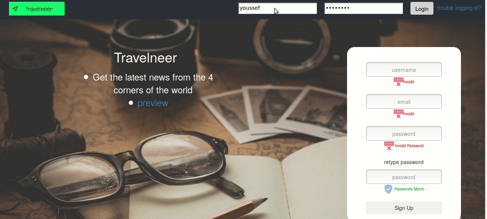

## Countrybook

Countrybook is a free and open-source social media where you can follow countries and get all the posts related to the countries you are following.

## License

Countrybook is open-source software licensed under the GNU AGPLv3.
      
## Supported Features:

- Signup and login
- Following and unfollowing countries
- Creating new posts to countries you are following
- Comments and replies
- Favouriting and unfavouriting posts

## Technologies

Server:
- OpenJdk
- Spring Boot
- Mariadb
- JOOQ
- Flywaydb

Client:
- Create React App
- React
- Redux
- Webpack
- SCSS
- CSS Modules

Please update this list if necessary

## Installation

Server:
 - https://github.com/youssef-sherif/countrybook/blob/master/server/travelneer-spring-boot/README.MD

Client:
 - https://github.com/youssef-sherif/countrybook/blob/master/client/travelneer-react/README.MD

## Contributing

Pull requests are welcome. For major changes, please open an issue first to discuss what you would like to change.

## Acknowledgments

- This project would not be possible without all the opensource libraries used (see Technologies for more details)
